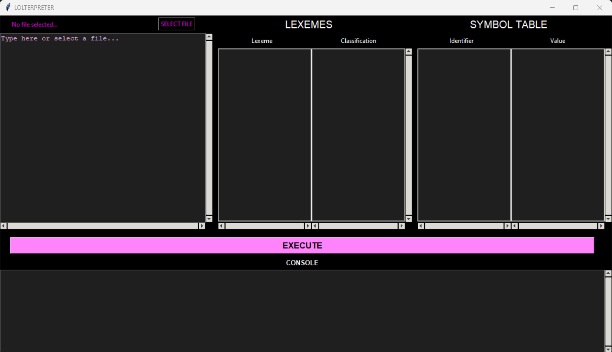
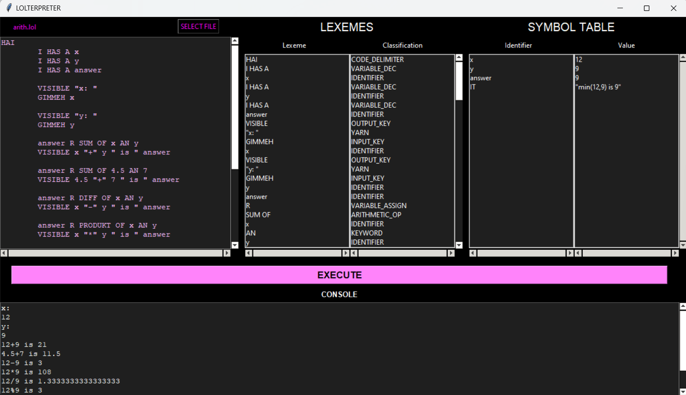

# LOLterpreter

An interpreter for the LOLCODE Programming Language built using Python. With lexical, syntax, and semantics analyzer; and a GUI that includes a text editor, console, file explorer, list of tokens, and symbol table.

### Sample Screenshots:

