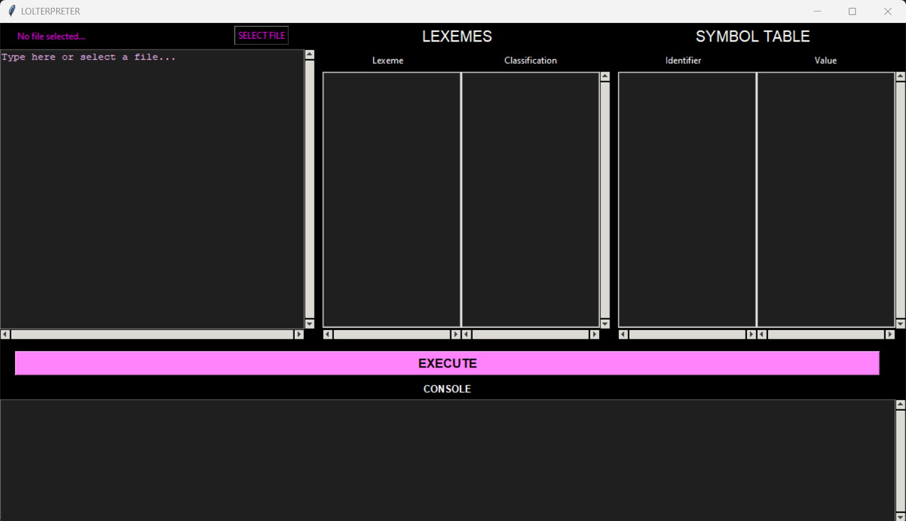
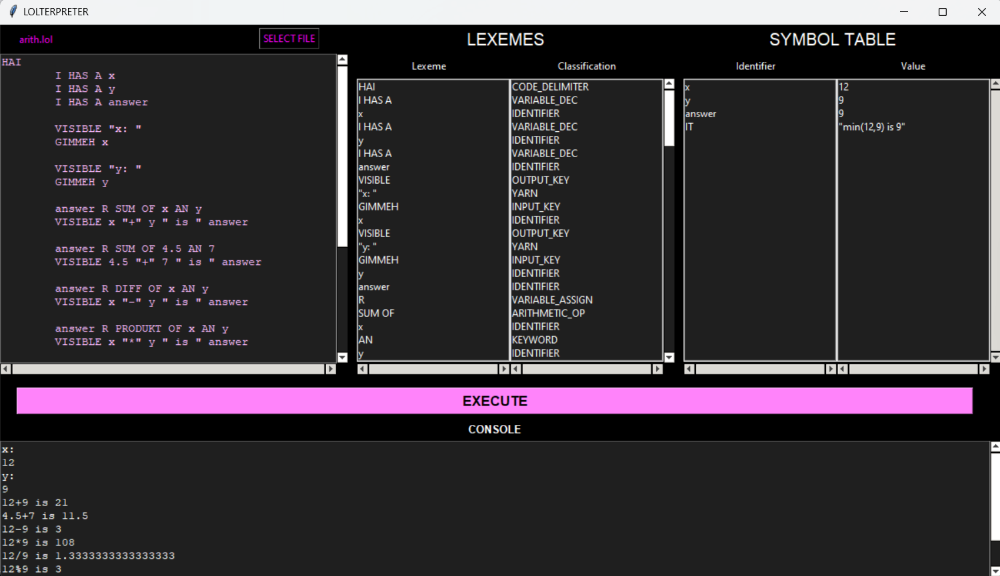

# LOLterpreter

An interpreter for the LOLCODE Programming Language built using Python. With lexical, syntax, and semantics analyzer; and a GUI that includes a text editor, console, file explorer, list of tokens, and symbol table.

## Features

- Lexical analysis with multi-word keyword support
- Recursive descent parser for full syntax validation
- Tree-walking interpreter with real-time execution
- Integrated GUI with live symbol table and lexeme viewer
- Support for: variables, arithmetic, boolean logic, I/O,
  conditionals (O RLY? / WTF?), loops, typecasting, and string
  concatenation (SMOOSH)

### Sample Screenshots:





## Architecture

```
Input (LOLCODE source)
|
v
+-------------+
| Lexer | lexer.py — tokenizes source into a flat
| | list of [token_type, token_value] pairs
+-------------+
|
v
+-------------+
| Parser | parse.py — recursive descent parser,
| | validates token stream against grammar
+-------------+
|
v
+-------------+
| Interpreter | interpreter.py — tree-walking interpreter,
| | manages symbol table and executes operations
+-------------+
|
v
GUI Output gui.py — displays results in real time
```

## How to Run

**Requirements:** Python 3.x (no external dependencies —
uses the standard library only)

Clone the repository:

```bash
git clone https://github.com/yourusername/LOLterpreter.git
cd LOLterpreter
```

Run the application:

```bash
python src/main.py
```

To run with a sample file, launch the app and use the
SELECT FILE button to load any .lol file from the
sample_files/ directory, then click EXECUTE.
